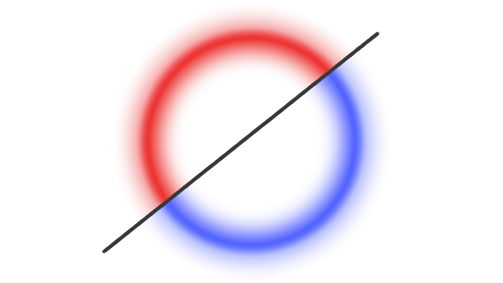

<h1 align="center"> <b> NOX </b> </h1>


<div>
  My attempt at a low-level version of JARVIS.
  <br></br>
  Mostly something to tinker on in my free time using tools I find online, or languages I had an idea in or something I wanted to learn better.
  <br></br>
  The end goal is to have a singular headless application with a separate web app UI that can control smart home devices, handle geolocation, schedule events, manage choosing a meal schedule for the week and/or anything else that strikes my fancy.
</div>

<hr></hr>

## Installation

Prerequisites:
* node
* golang
* docker
* [overmind](https://github.com/DarthSim/overmind)


To install (all-in-one):
```bash
$ git clone https://github.com/seanlowe/nox.git
$ cd nox

$ ./install.sh
```

You can also install things manually, if you so desire. Here's a [doc](./docs/manual-installation.md) on that process. Also in that document are links to all of the prereq's for easy access.

## Setup
After installation has finished, you'll want to create your `.env` file. I have included an `.env.example` with default values that you can change to your liking.

## Running nox
To run nox (in dev mode) once you've set it up to your liking, run:
```bash
$ overmind start
```
This will start two processes:
1. `npm run dev`
    - checks to see if a new database needs creating or if we can start an existing one
    - makes sure the database is up to date by running any migrations and seeders necessary
    - then starts the Next.js dev server
2. `go run ./noxd.go`
    - starts the Golang backend process

The app will be served at `localhost:5100/`. You can quit the app by running `overmind q` or pressing `Ctrl+C` in the terminal where overmind is running.

**Note:** ~~Optionally, you can choose to create a persistent instance of nox using PM2. If that's something you'd like to do, see [running with PM2](./docs/running-with-pm2.md)~~. This guide is outdated and needs updating. Please be patient.


## Database
This project uses [Prisma](https://www.prisma.io/) and [Schemix](https://github.com/ridafkih/schemix) to control database structure and [upper/db](https://github.com/upper/db) for database access from golang. 

In order to make a lasting change on the database or update it with newly created models, run:
```bash
# build schema.prisma file from all schemix files
$ npm run db:mix

# run any migrations
$ npm run db:migrate

# generate the prisma client
$ npm run db:generate
```
This creates a schema.prisma file based on your models in `./prisma/models/`, updates the database with changes you've made to the schema, then generates a new Prisma Client for use in the project.

To view your DB in the browser, run:
```bash
$ npm run db:view
```
It will be served at `localhost:5555/`


## Deprecated Versions
I had many different modules built out in JS/TS but none of them were connected in a way that's feasible for consistent use. As of right now, I'm keeping around a few of the ones which were a little more built out in case I need to reference them again later.

<hr></hr>

Built on [Next.js](https://nextjs.org/) with [Prisma](https://www.prisma.io/). Runtime management via [PM2](https://pm2.keymetrics.io/) and [overmind](https://github.com/DarthSim/overmind).

<br></br>

<!--
 - these styles will get stripped but leaving them in for when I get around to making
 - enough documentation to make a decent Github Pages
-->
<div style="display: flex; justify-content: space-evenly; align-items: center; flex-wrap: wrap;">
  <!-- nodeJS  -->
  <a href="https://github.com/nodejs" target="blank">
    
  </a>

  <!-- next.js -->
  <a href="https://github.com/vercel/next.js" target="blank">
    
  </a>

  <!-- postgres -->
  <a href="https://github.com/postgres" target="blank">
    
  </a>

  <!-- prisma -->
  <a href="https://github.com/prisma/" target="blank">
    
  </a>

  <!-- pm2 -->
  <a href="https://github.com/Unitech/pm2" target="blank">
    
  </a>
</div>

<br />
