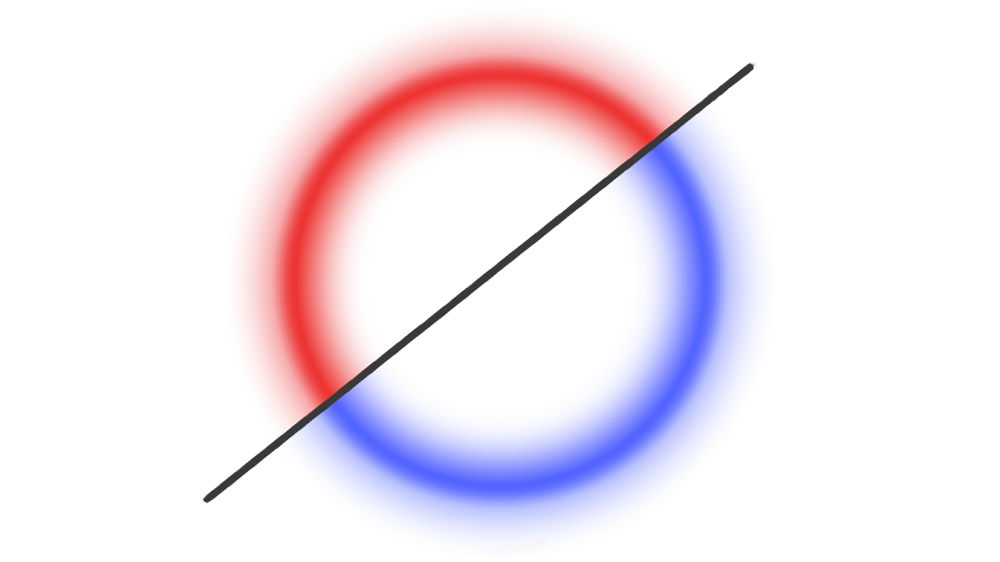
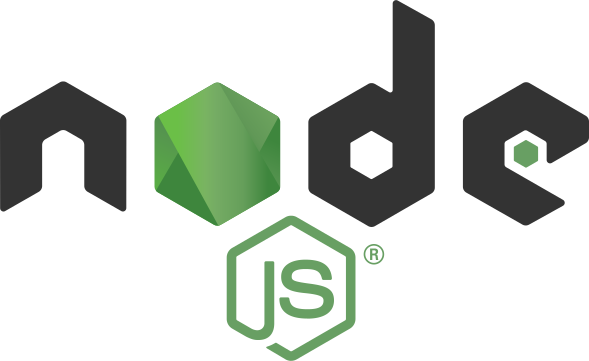

<center style="font-size: 40px; font-weight:bold; letter-spacing: 1.25rem;">
  NOX
</center>

<hr />


<div>
  My attempt at a low-level version of JARVIS.
  
  <br />
  Mostly something to tinker on in my free time using tools I find online, or languages I had an idea in or something I wanted to learn better.

  <br />
  The end goal is to have a singular headless application with a separate web app UI that can control smart home devices, handle geolocation, schedule events, manage choosing a meal schedule for the week and anything else that strikes my fancy.
</div>

<br />

## Installation
To install:
```bash
$ git clone https://github.com/seanlowe/nox.git
$ cd nox
$ npm install
```

## Setup
After installation has finished, you'll want to create your `.env` file. I have included an `.env.example` with default values that you can change to your liking.

## Running nox
To run nox (in dev mode) once you've set it up to your liking, run:
```bash
$ npm run dev
# this will:
# - check to see if a new database needs creating or if we can start an existing one
# - make sure the database is up to date by running any migrations and seeders necessary
# - then start the Next.js dev server
```

It will be served at `localhost:3000/`

**Note:** Optionally, you can choose to create a persistent instance of nox using PM2. If that's something you'd like to do, see [running with PM2](./docs/running-with-pm2.md).

<br />

## Prisma

This project uses Prisma to control database structure. After making any change to the [schema.prisma](/prisma/schema.prisma) file, run:
```bash
$ npm run db:migrate
$ npm run db:generate
```
This updates the database with changes you've made to the schema, then generates a new Prisma Client for use in the project.

To view your DB in the browser, run:
```bash
$ npm run db:view
```
It will be served at `localhost:5555/`

<br />

## Deprecated Versions
I had many different modules built out in JS/TS but none of them were connected in a way that's feasible for consistent use. As of right now, I'm keeping around a few of the ones which were a little more built out in case I need to reference them again later.

<br />
<hr />
<br />

Built on [Next.js](https://nextjs.org/) with [Prisma](https://www.prisma.io/). Runtime management via [PM2](https://pm2.keymetrics.io/).


<br />


<div style="display: flex; justify-content: space-evenly; align-items: center; flex-wrap: wrap;">
  <!-- nodeJS  -->
  <a href="https://github.com/nodejs" target="blank">
    
  </a>

  <!-- next.js -->
  <a href="https://github.com/vercel/next.js" target="blank">
    
  </a>

  <!-- postgres -->
  <a href="https://github.com/postgres" target="blank">
    
  </a>

  <!-- prisma -->
  <a href="https://github.com/prisma/" target="blank">
    
  </a>

  <!-- pm2 -->
  <a href="https://pm2.keymetrics.io/" target="blank">
    
  </a>
</div>

<br />
